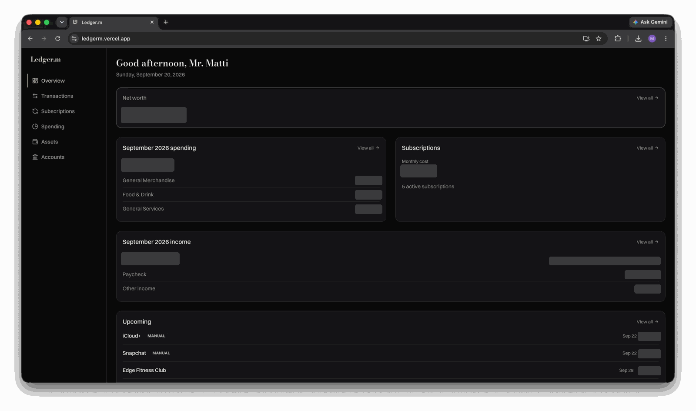
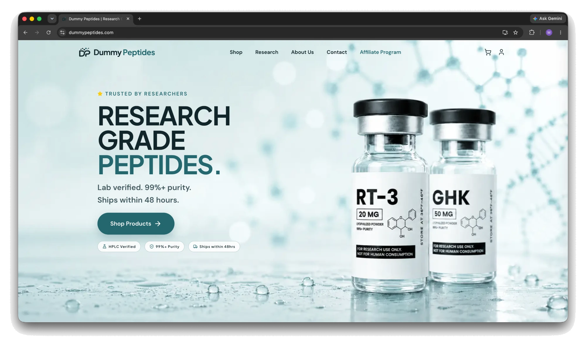
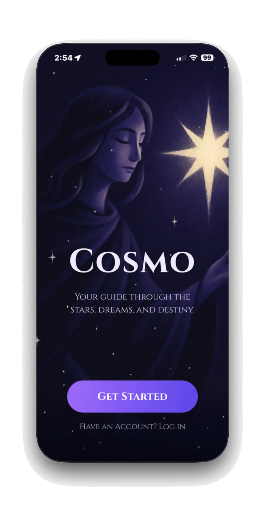
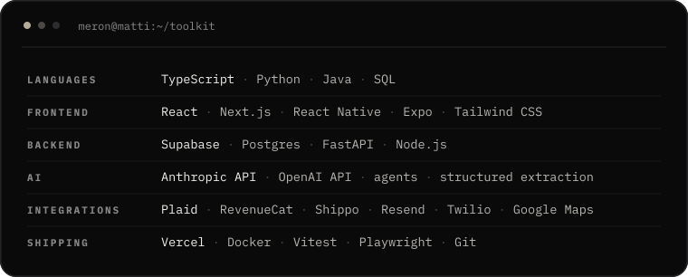

<picture>
  <source media="(max-width: 600px)" srcset="./assets/header-phone.svg" />
  
</picture>

 
 

I'm Meron, a Computer Science student at Oakland University. I build things for fun, and I ship them. So far that includes a finance app connected to my own bank accounts, a live storefront for a business I co-own, an agent that runs my Mac from my phone, and an iOS app with paid subscriptions.

 

<picture>
  <source media="(max-width: 600px) and (prefers-color-scheme: dark)" srcset="./assets/section-index-dark-phone.svg" />
  <source media="(max-width: 600px)" srcset="./assets/section-index-light-phone.svg" />
  <source media="(prefers-color-scheme: dark)" srcset="./assets/section-index-dark.svg" />
  
</picture>

<picture>
  <source media="(max-width: 600px)" srcset="./assets/index-phone.svg" />
  
</picture>

 
 

<picture>
  <source media="(max-width: 600px) and (prefers-color-scheme: dark)" srcset="./assets/section-work-dark-phone.svg" />
  <source media="(max-width: 600px)" srcset="./assets/section-work-light-phone.svg" />
  <source media="(prefers-color-scheme: dark)" srcset="./assets/section-work-dark.svg" />
  
</picture>

### [Ledger.m](https://github.com/MeronM18/Ledger.m) &nbsp;·&nbsp; personal finance

A single-user personal finance app connected to my real bank accounts through Plaid. It tracks net worth, monthly spending and income by category, recurring subscriptions, and upcoming payments.

`Next.js` `React` `TypeScript` `Tailwind CSS` `Supabase` `Plaid` `Vercel`

Private deployment (authentication required) &nbsp;·&nbsp; **[Source →](https://github.com/MeronM18/Ledger.m)**

 

### [Dummy Peptides](https://dummypeptides.com) &nbsp;·&nbsp; e-commerce

A live e-commerce storefront for a research-peptide business I co-own. It has a product catalog, customer accounts, a cart, and an affiliate program. Shipping, email, and SMS run through Shippo, Resend, and Twilio.

`React` `TypeScript` `Vite` `Tailwind CSS` `Supabase` `Vercel` `Shippo` `Resend` `Twilio` `Google Maps`

**[Visit the live site →](https://dummypeptides.com)** &nbsp;·&nbsp; **[Source →](https://github.com/MeronM18/dummypeptides)**

 

### [Imperium](https://github.com/MeronM18/Imperium) &nbsp;·&nbsp; AI agent

<a href="https://youtu.be/jEpbP-iGQTk">
  <picture>
    <source media="(max-width: 600px)" srcset="./assets/imperium-pipeline-phone.svg" />
    
  </picture>
</a>

 

A macOS automation agent, built with collaborators, that turns plain-English commands sent from a phone into AppleScript and app actions. It performs real actions on the Mac, so security came first. Every command goes through token-paired auth, tiered permissions, a script policy gate, and an audit log.

`Python` `FastAPI` `AppleScript` `Playwright` `Anthropic API`

**[Watch the demo →](https://youtu.be/jEpbP-iGQTk)** &nbsp;·&nbsp; **[Source →](https://github.com/MeronM18/Imperium)**

 

### [Cosmo](https://github.com/MeronM18/Cosmo) &nbsp;·&nbsp; iOS app

  

An iOS-first astrology app with personalized AI-generated readings, user accounts, and paid subscriptions through RevenueCat.

`Expo` `React Native` `TypeScript` `Supabase` `RevenueCat` `OpenAI`

**[Source →](https://github.com/MeronM18/Cosmo)**

 

<picture>
  <source media="(max-width: 600px) and (prefers-color-scheme: dark)" srcset="./assets/section-toolkit-dark-phone.svg" />
  <source media="(max-width: 600px)" srcset="./assets/section-toolkit-light-phone.svg" />
  <source media="(prefers-color-scheme: dark)" srcset="./assets/section-toolkit-dark.svg" />
  
</picture>

<picture>
  <source media="(max-width: 600px)" srcset="./assets/toolkit-phone.svg" />
  
</picture>

 
 

<picture>
  <source media="(max-width: 600px) and (prefers-color-scheme: dark)" srcset="./assets/section-progress-dark-phone.svg" />
  <source media="(max-width: 600px)" srcset="./assets/section-progress-light-phone.svg" />
  <source media="(prefers-color-scheme: dark)" srcset="./assets/section-progress-dark.svg" />
  
</picture>

#### [StayDue](https://github.com/MeronM18/StayDue) &nbsp;·&nbsp; private beta

An academic planner built with a collaborator. Upload a syllabus PDF and every deadline lands in one dashboard and calendar.

`Next.js` `Supabase` `OpenAI`

#### [EasyMail](https://github.com/MeronM18/EasyMail) &nbsp;·&nbsp; in development

A cross-inbox attention layer for Gmail and Outlook. It shows a recap first and triage second, and it isn't a mail client.

`Next.js` `Supabase` `Vitest`

 

<picture>
  <source media="(max-width: 600px) and (prefers-color-scheme: dark)" srcset="./assets/section-contact-dark-phone.svg" />
  <source media="(max-width: 600px)" srcset="./assets/section-contact-light-phone.svg" />
  <source media="(prefers-color-scheme: dark)" srcset="./assets/section-contact-dark.svg" />
  
</picture>

  
  &nbsp;
  

<code>meronmatti123@gmail.com</code>

 

<picture>
  <source media="(max-width: 600px)" srcset="./assets/footer-phone.svg" />
  
</picture>
