<picture>
  <source media="(max-width: 600px)" srcset="https://raw.githubusercontent.com/MeronM18/MeronM18/output/header-phone.svg" />
  
</picture>

  <a href="https://www.linkedin.com/in/meronmatti/">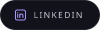</a>
  &nbsp;
  <a href="mailto:meronmatti123@gmail.com">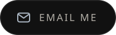</a>
  &nbsp;
  <a href="https://github.com/MeronM18">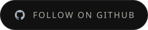</a>

 

I'm Meron, a Computer Science student at Oakland University. I build things for fun, and I ship them. So far that includes an agent that runs my Mac from my phone, a finance app wired to my own bank accounts (now with monthly budgets), a live storefront for a business I co-own, and an iOS app with paid subscriptions.

 

<picture>
  <source media="(max-width: 600px) and (prefers-color-scheme: dark)" srcset="./assets/sections/work-dark-phone.svg" />
  <source media="(max-width: 600px)" srcset="./assets/sections/work-light-phone.svg" />
  <source media="(prefers-color-scheme: dark)" srcset="./assets/sections/work-dark.svg" />
  
</picture>

 

<a href="https://youtu.be/jEpbP-iGQTk">
  <picture>
    <source media="(max-width: 600px)" srcset="./assets/cards/imperium-phone.webp" />
    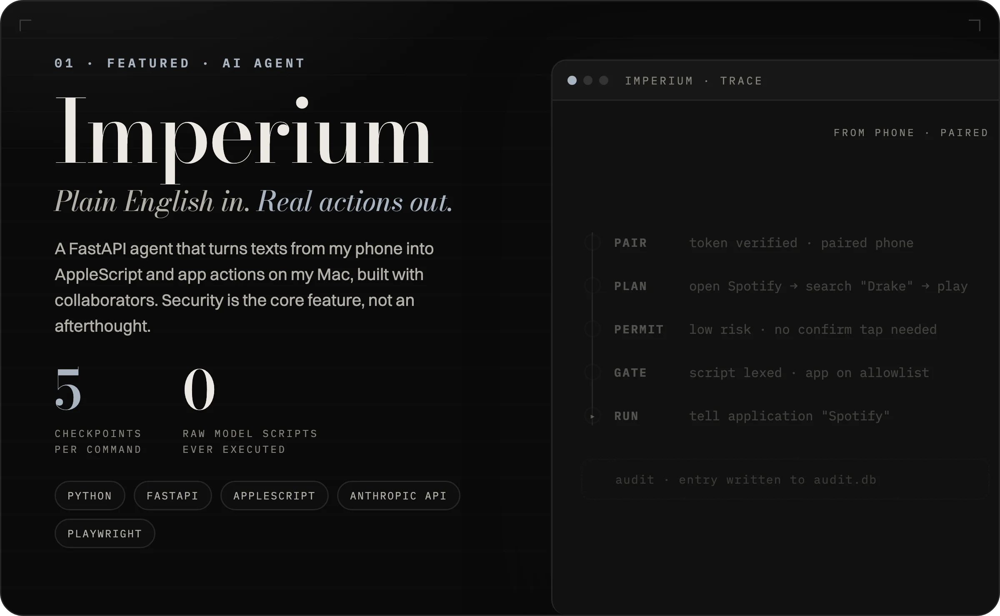
  </picture>
</a>

  <a href="https://youtu.be/jEpbP-iGQTk">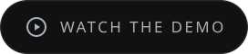</a>
  &nbsp;
  <a href="https://github.com/MeronM18/Imperium">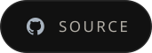</a>

 

<a href="https://github.com/MeronM18/Ledger.m">
  <picture>
    <source media="(max-width: 600px)" srcset="./assets/cards/ledger-phone.webp" />
    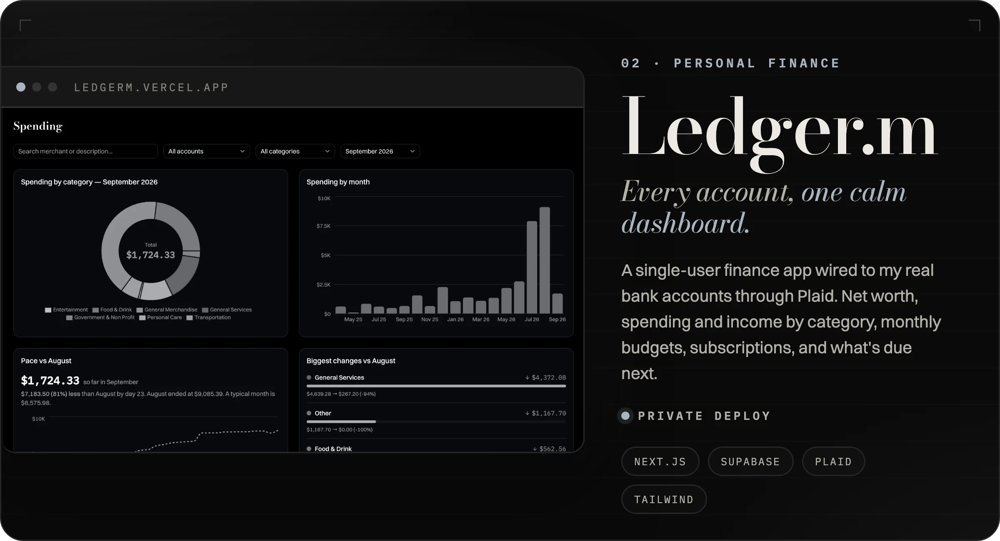
  </picture>
</a>

  
  &nbsp;
  

 

<a href="https://dummypeptides.com">
  <picture>
    <source media="(max-width: 600px)" srcset="./assets/cards/dummypeptides-phone.webp" />
    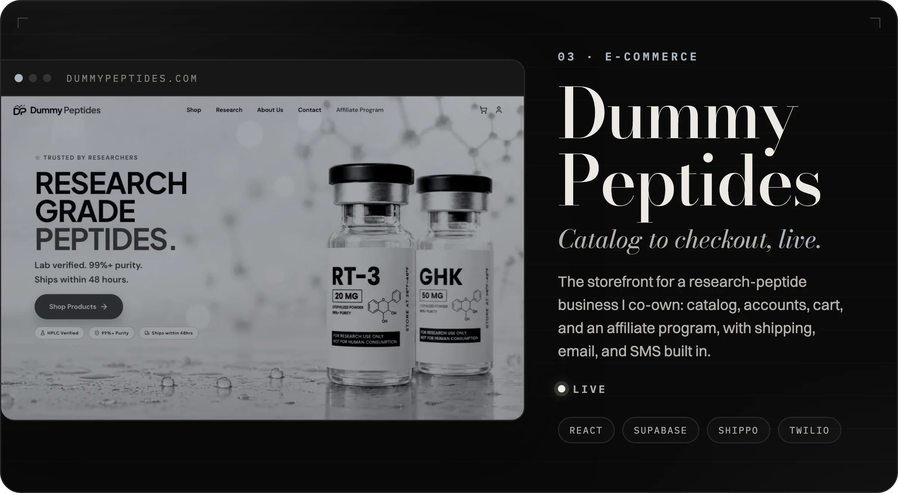
  </picture>
</a>

  <a href="https://dummypeptides.com">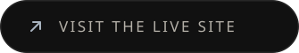</a>
  &nbsp;
  

 

<a href="https://github.com/MeronM18/Cosmo">
  <picture>
    <source media="(max-width: 600px)" srcset="./assets/cards/cosmo-phone.webp" />
    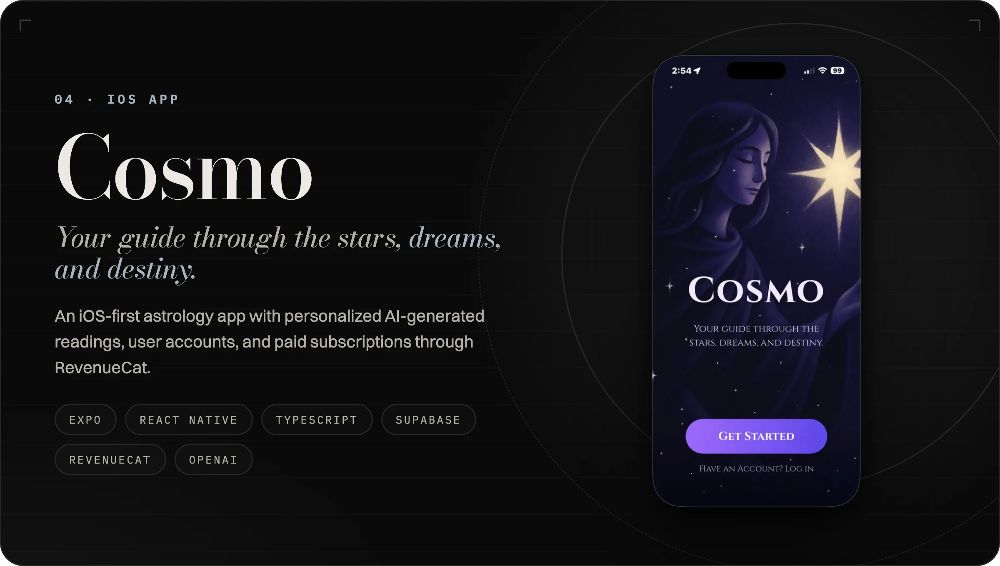
  </picture>
</a>

  

 

<picture>
  <source media="(max-width: 600px) and (prefers-color-scheme: dark)" srcset="./assets/sections/building-dark-phone.svg" />
  <source media="(max-width: 600px)" srcset="./assets/sections/building-light-phone.svg" />
  <source media="(prefers-color-scheme: dark)" srcset="./assets/sections/building-dark.svg" />
  
</picture>

 

<picture>
  <source media="(max-width: 600px)" srcset="./assets/cards/progress-phone.webp" />
  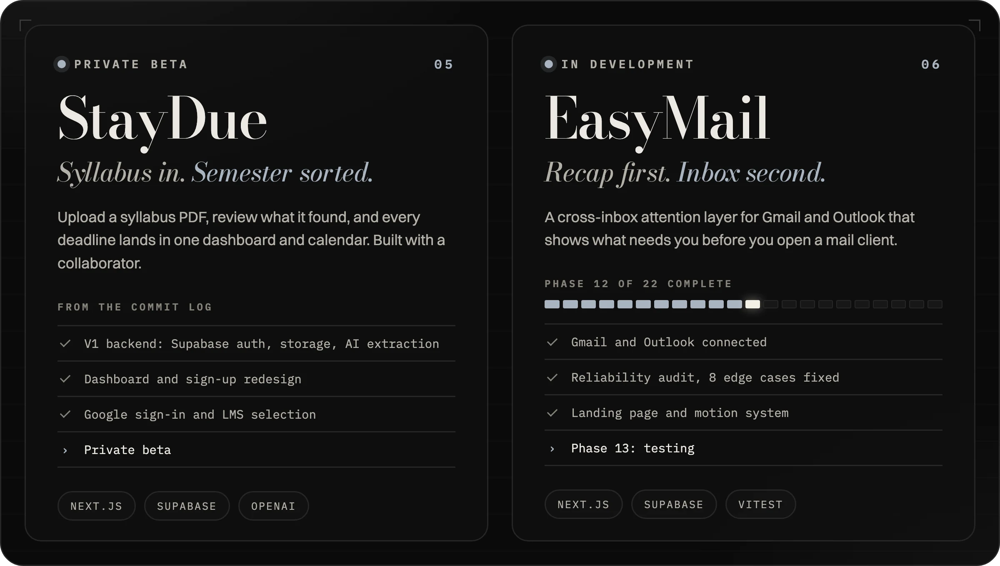
</picture>

  <a href="https://github.com/MeronM18/StayDue">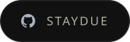</a>
  &nbsp;
  <a href="https://github.com/MeronM18/EasyMail">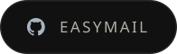</a>

 

<picture>
  <source media="(max-width: 600px) and (prefers-color-scheme: dark)" srcset="./assets/sections/toolkit-dark-phone.svg" />
  <source media="(max-width: 600px)" srcset="./assets/sections/toolkit-light-phone.svg" />
  <source media="(prefers-color-scheme: dark)" srcset="./assets/sections/toolkit-dark.svg" />
  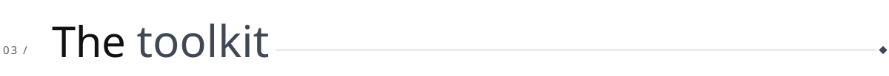
</picture>

 

<picture>
  <source media="(max-width: 600px)" srcset="./assets/stack-phone.svg" />
  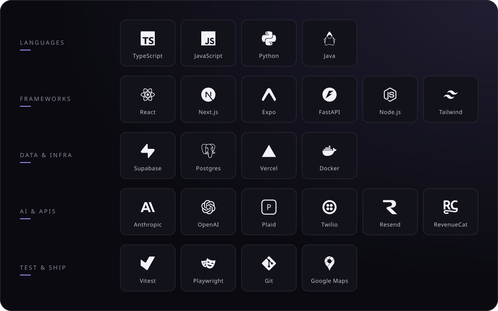
</picture>

 
 

<picture>
  <source media="(max-width: 600px) and (prefers-color-scheme: dark)" srcset="./assets/sections/activity-dark-phone.svg" />
  <source media="(max-width: 600px)" srcset="./assets/sections/activity-light-phone.svg" />
  <source media="(prefers-color-scheme: dark)" srcset="./assets/sections/activity-dark.svg" />
  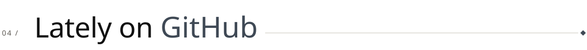
</picture>

 

<picture>
  <source media="(max-width: 600px)" srcset="https://raw.githubusercontent.com/MeronM18/MeronM18/output/stats-phone.svg" />
  
</picture>

 
 

<picture>
  <source media="(prefers-color-scheme: dark)" srcset="https://raw.githubusercontent.com/MeronM18/MeronM18/output/snake-dark.svg" />
  
</picture>

 
 

<a href="mailto:meronmatti123@gmail.com">
  <picture>
    <source media="(max-width: 600px)" srcset="./assets/footer-phone.svg" />
    
  </picture>
</a>
